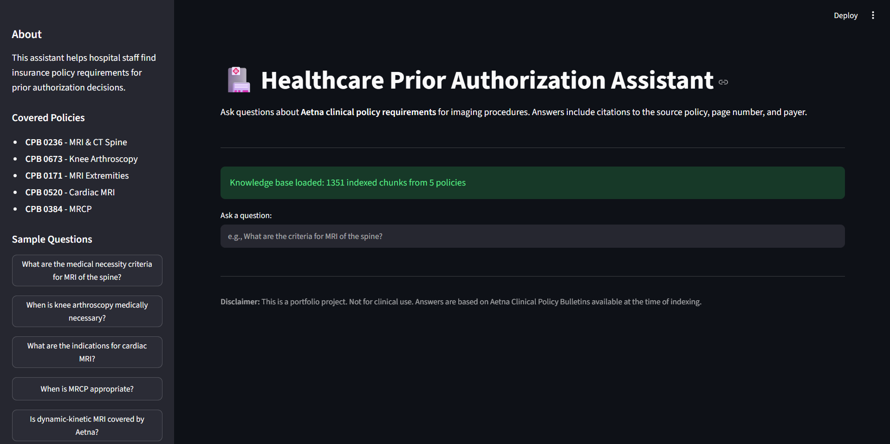
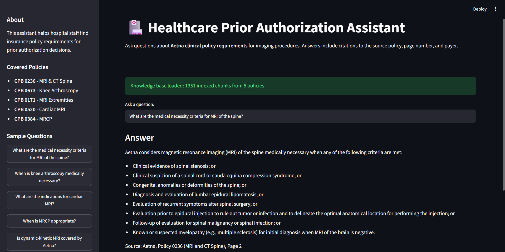
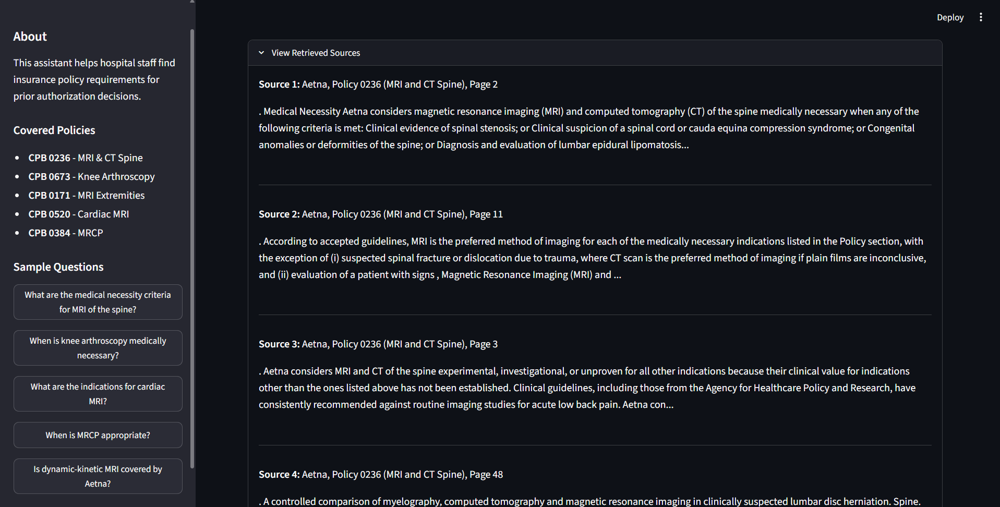
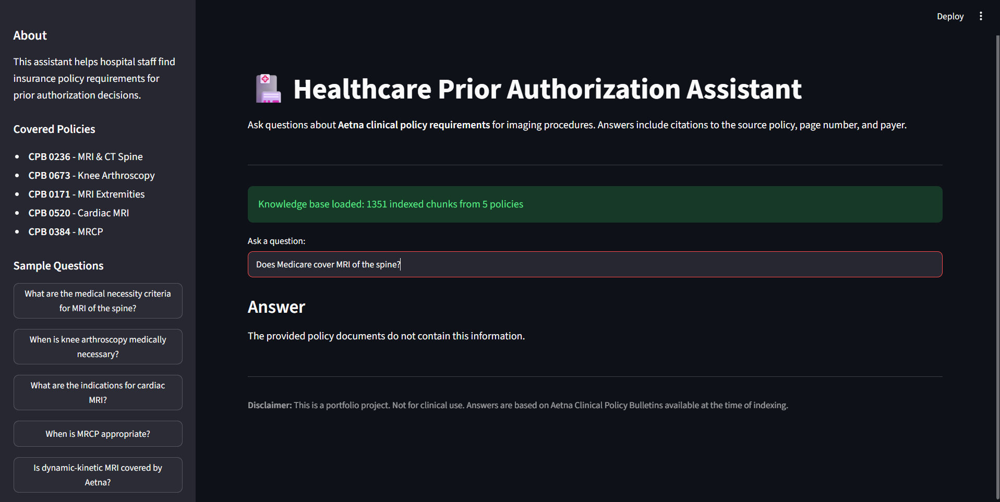

# Healthcare Prior Authorization AI Assistant

A production-quality RAG (Retrieval-Augmented Generation) application that helps hospital staff find insurance policy requirements for prior authorization decisions. Built with citations, safety guardrails, and multi-policy support across 5 Aetna Clinical Policy Bulletins.



---

## What This Project Does

Hospital staff performing prior authorization reviews spend hours searching payer clinical policy documents to determine whether a procedure meets medical necessity criteria. This assistant lets them ask natural language questions and receive grounded answers with citations to the exact policy, page number, and payer.

**Example query:** "What are the medical necessity criteria for MRI of the spine?"

**Response:** A bulleted list of criteria pulled directly from Aetna CPB 0236, with citation: `Source: Aetna, Policy 0236 (MRI and CT Spine), Page 2`

---

## What This Project Is NOT

- Medical diagnosis tool
- Patient-facing chatbot
- Clinical decision support system

It is a **policy retrieval assistant** designed for administrative prior authorization workflows.

---

## Key Features

- **Multi-policy support**: Indexes 5 Aetna clinical policies (386 pages, 1,351 chunks)
- **Grounded answers**: All responses cite the source policy and page number
- **Safety guardrails**: System declines out-of-scope queries rather than hallucinating
- **Zero hallucinations**: Verified across 12-query evaluation set
- **100% policy routing accuracy**: Correct payer/procedure identified for every in-scope query
- **Interactive UI**: Streamlit interface with clickable sample questions and expandable source view

---

## Demo Screenshots

### Answer with Citation
The system pulls medical necessity criteria directly from Aetna CPB 0236 with proper citation.



### Retrieved Sources View
Every answer can be traced back to its source chunks with page-level metadata.



### Safety Guardrail in Action
When asked about Medicare (out-of-scope, only Aetna is indexed), the system correctly declines instead of inventing an answer.



---

## Tech Stack

| Component | Technology |
|---|---|
| Language | Python 3.10 |
| PDF Ingestion | PyMuPDF (fitz) |
| Framework | LangChain |
| Embeddings | BAAI/bge-small-en-v1.5 (384-dim, normalized) |
| Vector Store | FAISS (persisted locally) |
| LLM | Google Gemini 3.5 Flash-Lite |
| UI | Streamlit |

---

## Architecture
```
PDF Files → PyMuPDF Extract → Text Cleaning → Filtering →
Chunking (800/150) → BGE Embeddings → FAISS Index →
Retriever (k=5) → Citation Prompt → Gemini LLM → Answer + Sources
```

For detailed architecture and design decisions, see [ARCHITECTURE.md](ARCHITECTURE.md).

---

## Evaluation Results

Tested on 12 queries across 5 policies plus 1 out-of-scope query.

| Metric | Score |
|---|---|
| Policy Routing Accuracy | **100%** (11/11) |
| Page Retrieval@5 | 72.7% (8/11) |
| Out-of-scope Decline Rate | **100%** (1/1) |
| Hallucination Rate | **0%** (0/12) |

Full breakdown and failure analysis in [RESULTS.md](RESULTS.md).

---

## Setup

### Prerequisites
- Python 3.10+
- Google Gemini API key ([get one free](https://aistudio.google.com/apikey))

### Installation

```bash
# Clone repository
git clone https://github.com/hundalekar/Healthcare-Prior-Authorization-AI-Assistant.git
cd Healthcare-Prior-Authorization-AI-Assistant

# Create virtual environment
python -m venv h1venv
h1venv\Scripts\activate  # Windows
# source h1venv/bin/activate  # Mac/Linux

# Install dependencies
pip install -r requirements.txt

# Configure API key
cp .env.example .env
# Edit .env and add your GOOGLE_API_KEY
```

### Data Setup

Download the following Aetna Clinical Policy Bulletins and place in `data/raw/`:
- CPB 0236 - MRI and CT of the Spine
- CPB 0673 - Knee Arthroscopy
- CPB 0171 - MRI of the Extremities
- CPB 0520 - Cardiac MRI
- CPB 0384 - MRCP

Available at: `https://www.aetna.com/cpb/medical/data/[policy_number]/[policy_number].html`

### Build Vector Store

Run the ingestion notebook to build the FAISS index:
```bash
jupyter notebook notebooks/01_document_analysis.ipynb
```

Run all cells. This creates `data/processed/faiss_index/`.

### Run the App

```bash
streamlit run app/streamlit_app.py
```

Open `http://localhost:8501` in your browser.

---

## Project Structure
```
Healthcare_Prior_Authorization_AI_Assistant/
├── app/
│ └── streamlit_app.py # Streamlit UI
├── data/
│ ├── raw/ # Aetna PDFs (gitignored)
│ ├── processed/faiss_index/ # FAISS vectorstore (gitignored)
│ └── evaluation_results.csv # Test set results
├── notebooks/
│ ├── 01_document_analysis.ipynb # Ingestion pipeline
│ ├── 02_rag_experiments.ipynb # RAG chain testing
│ └── 03_evaluation.ipynb # Evaluation runner
├── screenshots/ # Portfolio screenshots
├── src/
│ ├── ingestion/ # Load, clean, chunk PDFs
│ ├── retrieval/ # FAISS vectorstore
│ └── rag/ # Retriever, prompt, chain
├── ARCHITECTURE.md
├── EXPERIMENT_LOG.md
├── RESULTS.md
├── requirements.txt
└── README.md
```

---

## Sample Questions to Try

- "What are the medical necessity criteria for MRI of the spine?"
- "When is knee arthroscopy medically necessary?"
- "What are the indications for cardiac MRI?"
- "When is MRCP appropriate?"
- "Is dynamic-kinetic MRI covered by Aetna?"

---

## Known Limitations

- **Wording sensitivity**: Some queries fail if phrasing differs from the source document's terminology (e.g., "criteria" vs "indications" for Cardiac MRI). Hybrid retrieval (BM25 + vector) is a planned Phase 2 improvement.
- **Single payer**: Currently indexes only Aetna policies. Multi-payer expansion is straightforward - add PDFs to `data/raw/` and update metadata mapping.
- **Rate limits**: Free tier Gemini API has daily request limits. For production use, enable billing.

---

## Design Decisions

Key engineering trade-offs documented in [EXPERIMENT_LOG.md](EXPERIMENT_LOG.md):
- Why chunk size 800 outperformed 2000
- Why BGE-small was chosen over MiniLM
- Why merging steps were removed
- How safety guardrails were implemented via prompt engineering

---

## Roadmap

**Phase 2 (Planned):**
- Documentation gap checker (identify missing PA documentation)
- Automated RAGAS evaluation metrics

**Phase 3 (Future):**
- Hybrid retrieval (BM25 + vector)
- Cross-encoder reranking
- Analytics dashboard
- FastAPI + Docker deployment

---

## Disclaimer

This is a portfolio project for demonstration purposes. **Not for clinical use.** Answers are based on Aetna Clinical Policy Bulletins available at the time of indexing. Policy content may have changed since indexing.

---

## Author

**Abhishek Mohan Hundalekar**  
MS Applied Data Science, Syracuse University (Aug 2025 - May 2027)  
LinkedIn: https://www.linkedin.com/in/abhishekhundalekar/   
GitHub: https://github.com/hundalekar